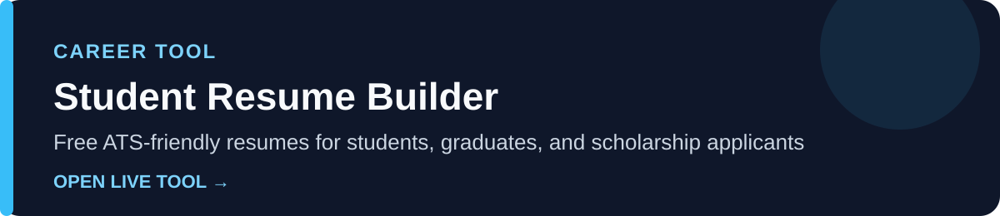
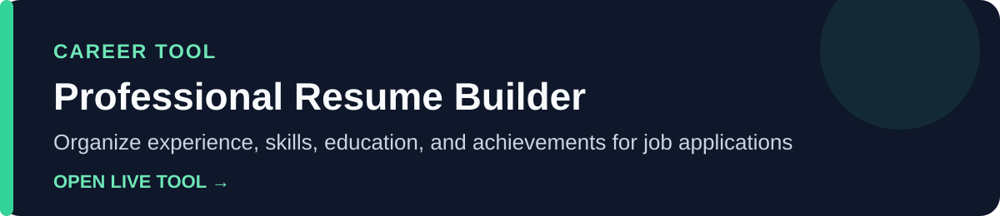
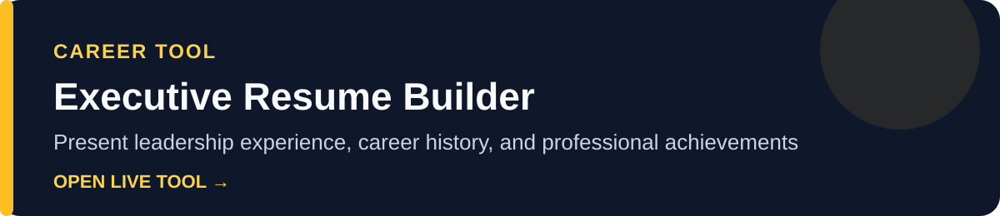
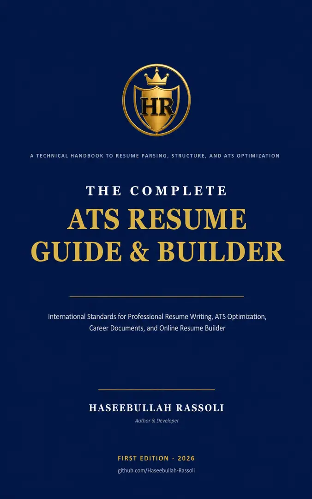
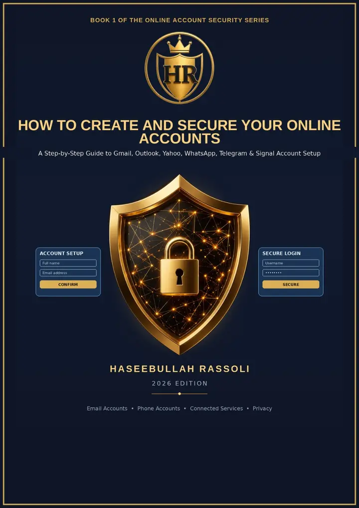
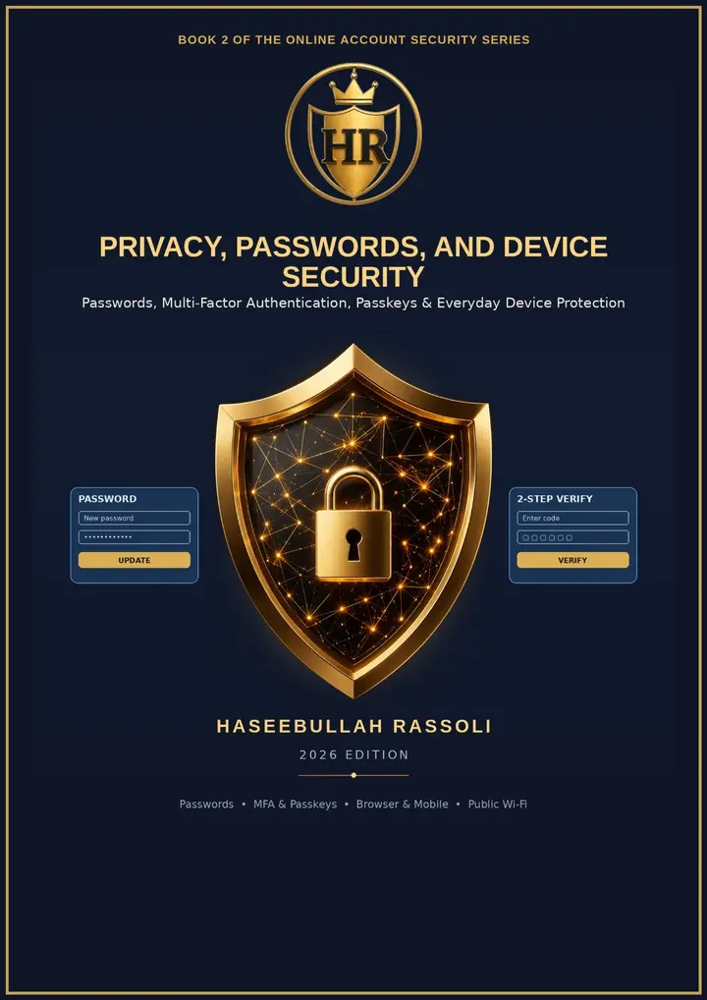

# Hi, I'm Haseebullah Rassoli

**Independent Computer Science & Cybersecurity Learner | Author | Creator of Practical Digital Resources**

I am an independent learner interested in computer science, cybersecurity, information technology, online privacy, account security, and practical technology. I create educational resources and browser-based career tools that help people organize information and take useful next steps.

> I use AI-assisted research and development tools to help transform ideas into practical digital resources while continuously building my knowledge of computer science and cybersecurity.

## About Me

My work brings together independent learning, careful research, and practical project development. I am especially interested in making digital security concepts easier to understand and creating straightforward tools for resumes, CVs, job applications, and scholarship applications.

This portfolio reflects an ongoing learning journey. It does not represent professional programming or cybersecurity credentials.

## Areas I'm Learning

- Computer science fundamentals and practical problem-solving
- Cybersecurity and digital security
- Information technology and technical troubleshooting
- Online privacy, account protection, password safety, and device security
- AI-assisted research and development
- Accessible digital resources for education and career development

## Featured Projects

These free browser-based resume builders help different audiences structure their information clearly. Each project supports practical resume writing and provides PDF and Word export options.

### Student Resume Builder

A student resume builder for students, recent graduates, scholarship applicants, and entry-level job seekers creating an ATS-friendly resume or student CV.

**[Open the Student Resume Builder](https://haseebullah-rassoli.github.io/student-resume/)** · [View the source repository](https://github.com/Haseebullah-rassoli/student-resume)

### Professional Resume Builder

A professional resume builder and CV builder for organizing work experience, skills, education, and achievements for a clear job application.

**[Open the Professional Resume Builder](https://haseebullah-rassoli.github.io/professional-resume/)** · [View the source repository](https://github.com/Haseebullah-rassoli/professional-resume)

### Executive Resume Builder

An executive resume builder for presenting leadership experience, career history, skills, and professional achievements in an ATS-friendly executive CV.

**[Open the Executive Resume Builder](https://haseebullah-rassoli.github.io/executive-resume/)** · [View the source repository](https://github.com/Haseebullah-rassoli/executive-resume)

## Books & Publications

I write practical resources about resume development, online account security, privacy, passwords, and device protection.

### Resume & Career Resource

  

**[The Complete ATS Resume Guide & Builder](https://a.co/d/0hdZU9Cs)** complements the three resume-builder projects with practical guidance for resume writing and ATS-friendly job application materials.

### Cybersecurity & Online Account Security Series

  

**[How to Create and Secure Your Online Accounts](https://a.co/d/01cXK59i)** covers practical ideas related to safer online account creation and protection.

  

**[Privacy, Passwords, and Device Security](https://a.co/d/066vMJtI)** focuses on online privacy, password safety, account protection, and device security.

**Next volume: Coming Soon**

## Current Focus

- Continuing my independent study of computer science and cybersecurity
- Developing practical resume and career resources
- Researching online privacy, account protection, and digital security
- Improving project accessibility, documentation, and usability
- Turning carefully evaluated ideas into useful educational resources

## Connect With Me

- [Explore all of my GitHub repositories](https://github.com/Haseebullah-rassoli?tab=repositories)
- [Use the Student Resume Builder](https://haseebullah-rassoli.github.io/student-resume/)
- [Use the Professional Resume Builder](https://haseebullah-rassoli.github.io/professional-resume/)
- [Use the Executive Resume Builder](https://haseebullah-rassoli.github.io/executive-resume/)
